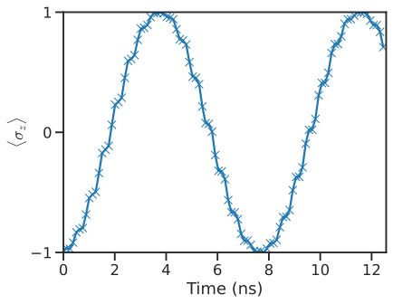

# qCHeff: GPU-accelerated effective Hamiltonian calculator

```{toctree} 
:hidden: 
user_guide/index
apidocs/index
developer_docs/index
```

{math}`\text{qCH}_\text{eff}` is a GPU-accelerated effective Hamiltonian calculator! 

:::{admonition} Early Development
{math}`\text{qCH}_\text{eff}` is still very early in development. Breaking changes should be expected.
:::

# Getting Started

Here's a quick example of how to use the package.

## Installation


{math}`\text{qCH}_\text{eff}` be installed using `pip`:
```bash
pip install qcheff
 ```
Detailed installation instruction are [provided here](user_guide/install.md). CuPy is required in order to use the GPU for computations. 

## Usage

### Operators in {math}`\text{qCH}_\text{eff}`

We provide easy access to some operators commonly-used in quantum physics simulations: `eye()`, `create()`, `destroy()`, `number()`, `identity()`, `basis()`, `projector()`, `charge()`, `position()`, `momentum()`, `sigmax()`, `sigmay()`, `sigmaz()`, `sigmap()`, `sigmam()`. Please refer to the [operators documentation](https://qcheff.readthedocs.io/en/latest/apidocs/qcheff/qcheff.operators.operators.html) for more details. For example, `eye()` creates an identity operator:


```python
from qcheff.operators import eye

eye_op_cpu = eye(3)
eye_op_cpu
```


    <Compressed Sparse Row sparse matrix of dtype 'complex128'
    	with 3 stored elements and shape (3, 3)>


By default, operators are created as sparse matrices on the CPU. We can also create operators on the GPU and use dense operators on either device.

Backend options can be set globally using the `qcheff_config` object. We can list the default parameters for the default config by printing it out.


```python
qcheff_config
```


    QCHeffConfig:
    	backend=cpu, 
    	sparse=True, 
    	debug=False, 
    	default_dtype=<class 'numpy.complex128'>


Backend options can be changed locally or for a single object using the `temp_config()` context manager. Below we create both a sparse and dense identity operator on the GPU.


```python
with temp_config(backend="gpu"):
    eye_op_gpu = eye(3)

eye_op_gpu
```


    <cupyx.scipy.sparse._csr.csr_matrix at 0x7bb86636b230>


```python
with temp_config(backend="gpu", sparse=False):
    eye_op_gpu_dense = eye(3)

eye_op_gpu_dense
```


    array([[1.+0.j, 0.+0.j, 0.+0.j],
           [0.+0.j, 1.+0.j, 0.+0.j],
           [0.+0.j, 0.+0.j, 1.+0.j]])


#### Creating operators from Numpy/CuPy arrays or `Qobj`.

To convert Numpy/CuPy arrays into a form that works with {math}`\text{qCH}_\text{eff}`, we can directly create either a `SparseOperator` or `DenseOperator`, which will automatically use the correct backend.


```python
from qcheff.operators import SparseOperator, DenseOperator
```


```python
cp_eye = cp.eye(4)
DenseOperator(cp_eye)
```


    DenseOperator(op=array([[1., 0., 0., 0.],
           [0., 1., 0., 0.],
           [0., 0., 1., 0.],
           [0., 0., 0., 1.]]), backend_module=<module 'cupy' from '/home/abhis/Documents/qCHeff/.venv/lib/python3.13/site-packages/cupy/__init__.py'>)


QuTiP's `Qobj` can also be converted to either format by passing the underlying data array to `SparseOperator` or `DenseOperator`.


```python
DenseOperator(qt.qeye(3)[:])
```


    DenseOperator(op=array([[1.+0.j, 0.+0.j, 0.+0.j],
           [0.+0.j, 1.+0.j, 0.+0.j],
           [0.+0.j, 0.+0.j, 1.+0.j]]), backend_module=<module 'numpy' from '/home/abhis/Documents/qCHeff/.venv/lib/python3.13/site-packages/numpy/__init__.py'>)


These operators can then be used as inputs to methods specified in {math}`\text{qCH}_\text{eff}`.

### Iterative Schrieffer-Wolff Transformation (ISWT)

We provide a numerical implementation of [NPAD](https://journals.aps.org/prxquantum/abstract/10.1103/PRXQuantum.3.030313). If the structure and symmetries of the Hilbert space are known to be block-diagonalizable, NPAD can efficiently calculate a specific subset of eigenvalues without resorting to full numerical diagonalization.

Let us consider an example of two coupled Kerr oscillators. We will create a test system using `scqubits`, with the Hamiltonian {math}`H=H_0 + V`, where

```{math}
H_0 &= \sum_{i=1, 2} E_i a_i^\dagger a_i - K_i a_i^\dagger a_i^\dagger a_ia_i \\
V &= g (a_1 a^\dagger_2 + a^\dagger_1 a_2)
```

```python
import scqubits as scq


q1 = scq.KerrOscillator(E_osc=10.0, K=5.3, truncated_dim=3)
q2 = scq.KerrOscillator(E_osc=12.3, K=3.7, truncated_dim=3)

hs = scq.HilbertSpace([q1, q2])
hs.add_interaction(
    g=0.5,
    op1=q1.creation_operator,
    op2=q2.annihilation_operator,
    add_hc=True,
)
```

    SyntaxWarning: invalid escape sequence '\p'
     /home/abhis/Documents/qCHeff/.venv/lib/python3.13/site-packages/scqubits/core/zeropi.py: 284


```python
ham = hs.hamiltonian()
ham
```


Quantum object: dims=[[3, 3], [3, 3]], shape=(9, 9), type='oper', dtype=CSR, isherm=True
```{math}
\left(\begin{array}{cc}0 & 0 & 0 & 0 & 0 & 0 & 0 & 0 & 0\\0 & 12.300 & 0 & 0.500 & 0 & 0 & 0 & 0 & 0\\0 & 0 & 17.200 & 0 & 0.707 & 0 & 0 & 0 & 0\\0 & 0.500 & 0 & 10 & 0 & 0 & 0 & 0 & 0\\0 & 0 & 0.707 & 0 & 22.300 & 0 & 0.707 & 0 & 0\\0 & 0 & 0 & 0 & 0 & 27.200 & 0 & 1 & 0\\0 & 0 & 0 & 0 & 0.707 & 0 & 9.400 & 0 & 0\\0 & 0 & 0 & 0 & 0 & 1 & 0 & 21.700 & 0\\0 & 0 & 0 & 0 & 0 & 0 & 0 & 0 & 26.600\end{array}\right)
```


Let's now use NPAD to eliminate the smallest coupling. We can do this after initializing the `NPAD` object and then using the `eliminate_coupling()` method. This method will perform a Givens rotation in the specified two-level subspace. We can see below that the coupling has been eliminated and the energies of the coupled level (on the diagonal) are changed.


```python
from qcheff.iswt import NPAD

# Instantiate the NPAD object
zz_npad = NPAD(DenseOperator(ham[:]))

# Eliminate one coupling
zz_npad.eliminate_coupling(1, 3)
qt.Qobj(zz_npad.H.op.toarray())
```


Quantum object: dims=[[9], [9]], shape=(9, 9), type='oper', dtype=Dense, isherm=True
```{math}
\left(\begin{array}{cc}0 & 0 & 0 & 0 & 0 & 0 & 0 & 0 & 0\\0 & 12.404 & 0 & -4.441\times10^{ -16 } & 0 & 0 & 0 & 0 & 0\\0 & 0 & 17.200 & 0 & 0.707 & 0 & 0 & 0 & 0\\0 & -2.220\times10^{ -16 } & 0 & 9.896 & 0 & 0 & 0 & 0 & 0\\0 & 0 & 0.707 & 0 & 22.300 & 0 & 0.707 & 0 & 0\\0 & 0 & 0 & 0 & 0 & 27.200 & 0 & 1 & 0\\0 & 0 & 0 & 0 & 0.707 & 0 & 9.400 & 0 & 0\\0 & 0 & 0 & 0 & 0 & 1 & 0 & 21.700 & 0\\0 & 0 & 0 & 0 & 0 & 0 & 0 & 0 & 26.600\end{array}\right)
```


### Time evolution using the Magnus expansion

We provide a direct first-order Magnus series-based time evolution in {math}`\text{qCH}_\text{eff}`. We can use this method to simulate time-evolution for quantum systems

Below we show how to use our Magnus-based time evolution for a single resonantly-driven spin. This system is described by the Hamiltonian

```{math}
H_{\rm lab} = \frac{\omega}{2}\sigma_{z}+\frac{\Omega(t)}{2}\cos(\omega t)\sigma_{x},
```

The first term is called the drift Hamiltonian and the second term is the control/drive Hamiltonian. {math}`\Omega(t)` is the control pulse, modulatated at the qubit frequency {math}`\omega`. For simplicity, we assume a flat-top pulse.


```python
from qcheff.operators import sigmaz, sigmax, basis

# Qubit frequency
omega = 2 * np.pi * 1
drift_ham = DenseOperator(0.5 * omega * sigmaz())
control_hams = [DenseOperator(sigmax())]

# Initial State
psi0 = DenseOperator(np.array([0, 1]))

# Time list for creating the control signal
tlist = np.linspace(0, 2 * np.pi * 2, 1000)
control_sigs = 0.85 * np.cos(omega * tlist)
```


```python
from qcheff.magnus import magnus

# Magnus object
spin_magnus = magnus(tlist, drift_ham, control_sigs, control_hams)
```

This returns a `MagnusTimeEvolDense` object. We can call the `.evolve()` method specifying how many Magnus intervals we want to use for the integration.


```python
# time-evolved states (returned as generator)
states = spin_magnus.evolve(init_state=psi0, num_intervals=100)

# Sigma Z expectation values.
popz = [qt.expect(qt.sigmaz(), qt.Qobj(state)) for state in states]
```


```python
with (
    sns.plotting_context("talk"),
    sns.axes_style("ticks"),
    matplotlib.rc_context({"mathtext.fontset": "cm"}),
):
    fig, ax = plt.subplots()

    ax.plot(tlist[::10], popz, "x-")
    ax.yaxis.set_major_locator(matplotlib.ticker.MaxNLocator(3, integer=True))
    ax.set(
        ylim=(-1, 1),
        ylabel=r"$\langle \sigma_z\rangle$",
        xlabel="Time (ns)",
        xlim=tlist[[0, -1]],
    )

```


    

    

# Contributing

We use the permissive [MIT](https://choosealicense.com/licenses/mit/) license. Pull requests are welcome. For major changes, please open a GitHub issue first to discuss what you would like to change. Please make sure to update tests as appropriate. More developer documentation is available [here](developer_docs/index).

# Citing {math}`\text{qCH}_\text{eff}`
 If you use {math}`\text{qCH}_\text{eff}` in your work, please cite our [paper](https://arxiv.org/abs/2411.09982): 

```bibtex
@article{qcheff2025,
      title={GPU-accelerated Effective Hamiltonian Calculator}, 
      author={Abhishek Chakraborty and Taylor L. Patti and Brucek Khailany and Andrew N. Jordan and Anima Anandkumar},
      year={2025},
      eprint={2411.09982},
      archivePrefix={arXiv},
      primaryClass={quant-ph},
      url={https://arxiv.org/abs/2411.09982}, 
}

```

<!-- 
# Indices and tables

```{eval-rst}
* :ref:`genindex`
* :ref:`modindex`
* :ref:`search`
``` -->
